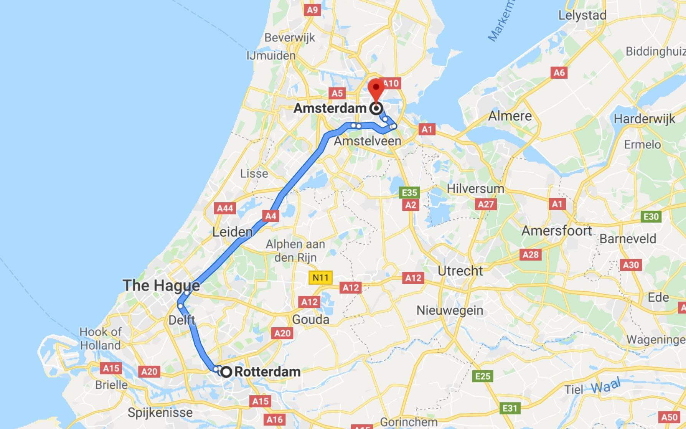
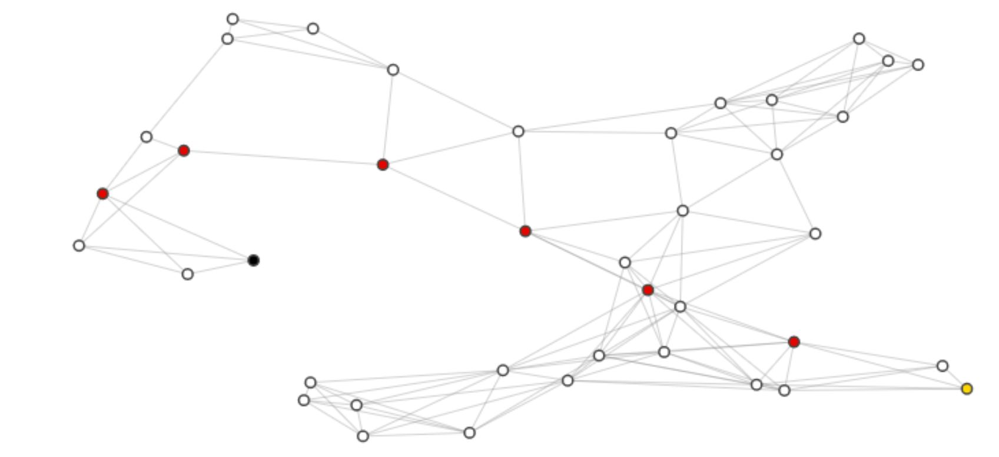

# Route-Planner
 Google maps style routing algorithm to calculate the shortest path between two points using A* search algorithm.

 
 
 
 Finding the shortest path between two locations is a key task in path planning expecially for self driving cars to navigate from point A to point B.
 Given that the map is known, this can be represented under the form of a graph. Cities are seen as nodes and roads are it's edges. For each city the global position is considered known, in terms of latitude and longitude, together with a list of it's neighboring cities.
 The car's current location is node A and it's destination city is node B. Now that the problem has been reduced to a graph representation, the task is limited to a graph search that is best suited for this case.
 
 # Graph Search
 
 
 
 The best algorithm for this graph search needs to take into account two factors. The first is minimizing the total distance or cost of the final route. The second is how the shortest route can be computed. Operating on a real time system as in an autonomous vehicle, the efficiency of the algorithm is a big concern.
 
 - Uniform Cost Search
 Distances between cities can be seen as cost. Finding the shortest path is reduced to minimizing the total cost of the path. The Uniform Cost Search is guaranteed to find the cheapest path from a starting node to the destination.
 Best Cost Search algorithm based on [Dijkstra's algorithm] (https://en.wikipedia.org/wiki/Dijkstra%27s_algorithm ) applies the cheapest first method, expanding the shortest route from the start in every direction. The nodes are explored in order based on how far they are from the start and keeping track of the total cost. When the destination is found and picked as being the shortest path from the start, we know that we found the shortest route. If all roads would be equal in cost, this search method is basicly the [Breadth First Search] (https://en.wikipedia.org/wiki/Breadth-first_search)
 This algorithm works well if there is no concern for efficiency and number of operations. The bigger the map, the more obvious the inefficiency is. Imagine looking for your destination while going in the opposite direction.
  
 - Best First Search
 We want a targeted search that gets us in the direction of the destination. For this we calculate the estimate distance between the start point and the destination. For the map search this is the straight line between nodes A and B.
 [Best First Search](https://en.wikipedia.org/wiki/Best-first_search), or greedy algorithm, always searches for the next node which gets you closest to the destination based on the estimate of the distance. Since it does not keep record of the lowest total cost, it will find the destination but it will not always provide the shortest route, for example if there are obstacles along the way.
 
 - A*
 Finding the shortest path while searching in the correct direction is where [A*](https://en.wikipedia.org/wiki/A*_search_algorithm) is the best choice. A* is expanding the route that keeps the sum of total cost and the distance estimation to the goal to a minimum.
 The distance estimation is called the heuristic. For A* to find the shortest path, the heuristic of each node needs to be optimistic, or to represent an estimation that is shorter or equal than the real distance. This requirement is fulfilled when the heuristic is the straight distance between two points on a map since real roads paths are generally longer.
 
 # Implementation
 This project is implemented in Python under Jupyter Notebook. The files are:
 - project_notebook.ipynb
 - helpers.py
 - test.py
 
 From helpers.py two maps are imported. A map is created through the class Map who builds a graph (as a network) from values given in a dictionary. The information about the map is kept in the dictionary as keys for nodes ids and values for the city's latitude and longitude as well as the adjacent cities.
 test.py is provided by Udacity to test the results of the implementation given the provided two maps.
 The A* algorithm is implemented in project_notebook.ipynb using starter code provided by Udacity.
 PathPlanner class is defined to get a map, a start node and destination node and method is defined to compute the shortest path between those two while searching in the right direction. An open set and closed set are being kept. The closed set is to keep nodes that have already been evaluated and the open set is to keep nodes that have been discovered but not evaluated yet. The open set is also known to be the frontier of the search.
 gScore and fScore are values associated to each node to keep trach of the cost of a path. gScore is the cost of the already found path to a given node and it represents the real distance from the start to reach that node. fScore = gScore + h, where h is the heuristic or the estimated distance from the node to the goal, which is computed as a straight line between the two. So, the fScore of a node is the total already traveled distance to get there, plus the estimated distance to the goal.
 The algorithm adds the start node in the openSet and explores from there. Includes the start node's neighbours in the openSet and calculates the gScore for each of them. Since we have latitude and longitude coordinates, the distance betwoon two connected nodes is the straight line between them. The next node that is explored is the one that has the lowest fScore and this is to be done until the goal is found.
 After having found the goal, to be able to reconstruct the path, the cameFrom information is used for each node. cameFrom is a dictionary constructed along with the search and it gives each node the most efficient previous node to be reached from.